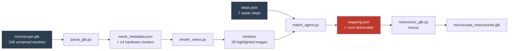
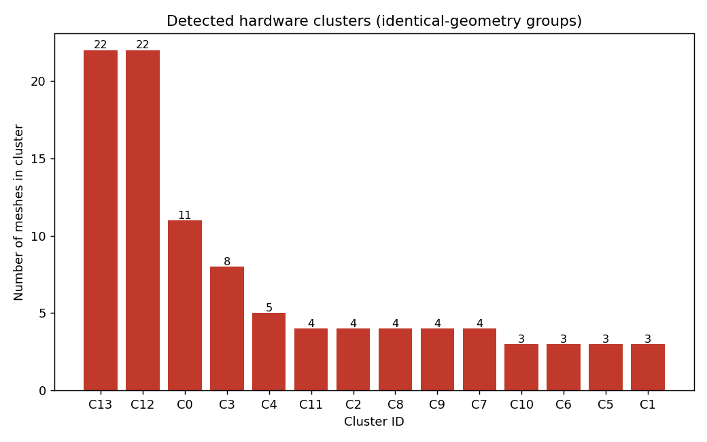
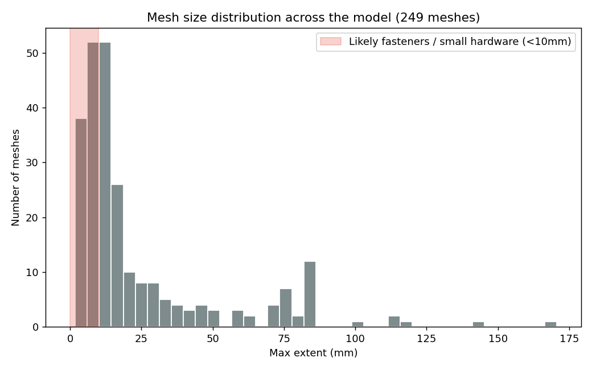

# Service-to-3D Mapping & Hierarchy Reconstruction

Maps textual service/repair instructions to raw, unnamed 3D mesh geometry in a
chaotic GLB model — no parts catalog, no existing names — using geometric
clustering + a vision-language agent, and (optionally) rewrites the GLB's
hierarchy so the file itself mirrors the repair steps.

Built for the **Service-to-3D Mapping & Hierarchy Reconstruction** hackathon
problem statement. Test case: a microscope teardown, 7 repair steps, 249
unnamed meshes.

---

## The problem

You get:

- A set of plain-text repair steps (e.g. _"Remove the bottom circuit board"_)
- A `.glb` 3D model with a flat, chaotic hierarchy — every mesh named
  something like `Mesh_113`, zero semantic naming, no catalog to look things
  up in.

You need to figure out, automatically, which 3D mesh(es) correspond to each
step — down to identifying individual tiny screws — and output a mapping.
Bonus points for restructuring the GLB itself to match.

## Approach

The pipeline runs in four stages:

| Stage      | What it does                                                                                                                                   | Script                   |
| ---------- | ---------------------------------------------------------------------------------------------------------------------------------------------- | ------------------------ |
| 1. Parse   | Load the GLB, dump every mesh's vertex count, bounding box, extent, centroid, parent node                                                      | `parse_glb.py`           |
| 2. Cluster | Group near-identical meshes by (vertex count, size) — catches repeated hardware like screws/clips without needing to look at them individually | (part of `parse_glb.py`) |
| 3. Render  | Headless-render the full assembly, plus one highlighted (red) view per cluster/large mesh, so the pieces are actually _visible_                | `render_views.py`        |
| 4. Match   | Feed all renders + all step text to a vision-language model in one pass; it reasons across steps and images and returns a structured mapping   | `match_agent.py`         |

**Why this order:** geometry clustering (stage 2) is cheap and deterministic
— it does the "distinguish tiny screws" work before any AI call, so the
vision model only has to reason about ~28 grouped candidates instead of all
249 individual meshes one-by-one. That's the "agentic harness" efficiency
judges are scoring.

## Pipeline flow



## The data, visualized

**249 meshes, zero names, 14 repeated-hardware clusters found automatically:**



**Size distribution across the whole model — the red band is where fasteners live:**



This is the evidence for the clustering claim in the Approach section above —
14 groups of near-identical meshes, concentrated in the sub-10mm range,
found purely from geometry before any AI call.

### Why not a 3D-only or text-only approach?

- Geometry alone (size/position) can't tell you a mesh is a "circuit board"
  vs. a "sample clip" — need visual/semantic reasoning.
- Text alone has nothing to ground itself in — there's no parts catalog.
- Combining both (cluster on geometry, identify on vision) is cheaper and
  more accurate than brute-forcing a VLM call per individual mesh.

## Repo structure

service-to-3d-mapping/
├── microscope.glb # input 3D model (not committed if large — see .gitignore)
├── steps.json # input repair steps
├── parse_glb.py # stage 1+2: metadata extraction + clustering
├── mesh_metadata.json # output of stage 1+2
├── render_views.py # stage 3: headless rendering
├── renders/ # output of stage 3 (28 PNGs)
├── match_agent.py # stage 4: VLM matching -> mapping.json
├── mapping.json # ⭐ core deliverable: step -> mesh IDs
├── restructure_glb.py # bonus: renames/regroups the GLB hierarchy
├── microscope_restructured.glb # bonus deliverable
└── README.md

## Setup

```bash
pip install trimesh pygltflib matplotlib pillow requests
```

**For matching, pick ONE:**

**Option A — Claude API** (paid, most accurate, ~$0.05 per full run)

```bash
pip install anthropic
export ANTHROPIC_API_KEY="sk-ant-..."      # Windows PowerShell: $env:ANTHROPIC_API_KEY="sk-ant-..."
```

**Option B — Ollama, local, free**

```bash
# install from https://ollama.com/download, then:
ollama pull qwen2.5vl:7b
```

Edit the top of `match_agent.py` to point at whichever backend you're using
(both variants are included / commented).

## How to run

```bash
python parse_glb.py           # -> mesh_metadata.json
python render_views.py        # -> renders/ (28 images)
python match_agent.py         # -> mapping.json
python restructure_glb.py     # optional bonus -> microscope_restructured.glb
```

Each script reads the previous stage's output, so run them in order the
first time. If you only change matching logic, you can re-run just
`match_agent.py`.

## Output format — `mapping.json`

```json
{
  "1": {
    "mesh_ids": ["Mesh_52", "Mesh_54"],
    "source_renders": ["cluster_03.png"],
    "reasoning": "matches the electronics drawer slide mechanism"
  },
  "2": { "...": "..." }
}
```

Keys are step numbers (as strings, matching `steps.json`), values list the
matched mesh ID(s), which render(s) that decision was based on, and a short
justification for auditability.

## Known limitations

- Rendering uses `matplotlib` (headless, no GPU needed) rather than a proper
  raster/raytracer — good enough for shape/silhouette identification, not
  photorealistic.
- The VLM sees each mesh only from the render angles we generated; a part
  fully occluded in every rendered angle could be missed.
- Fastener clustering groups by geometry similarity, not by which step
  actually uses them — the VLM still has to assign clusters to the right
  step.

## Credits / stack

Python, [trimesh](https://trimesh.org/) (GLB parsing), [pygltflib](https://gitlab.com/dodgyville/pygltflib)
(GLB rewriting), matplotlib (headless rendering), Claude / Ollama (vision
matching).
