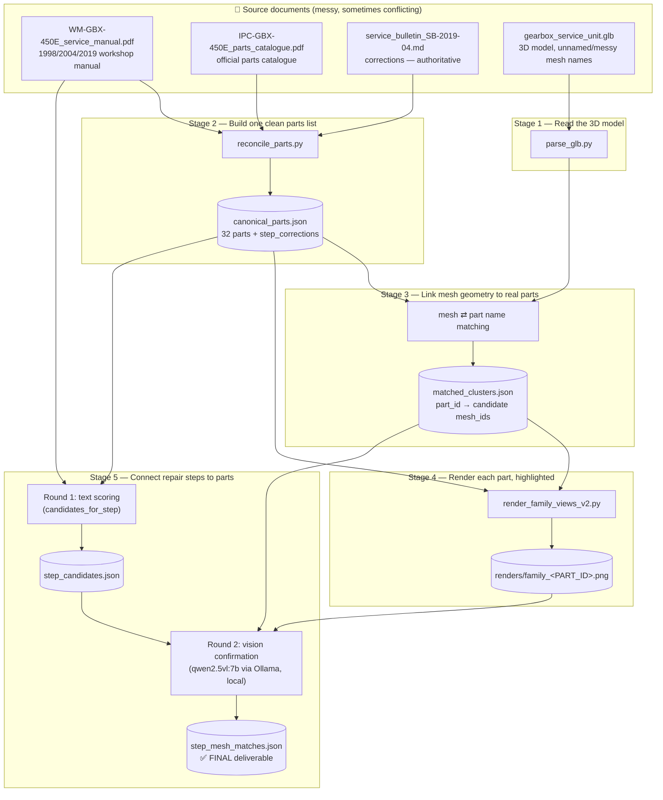
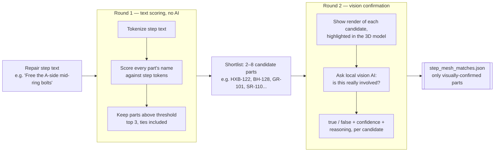
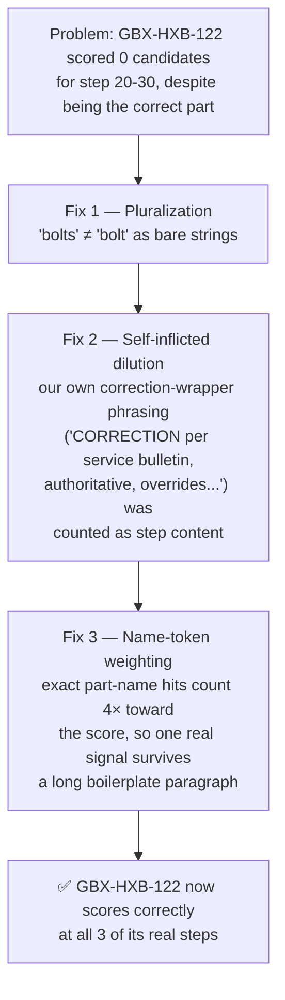

# Service-to-3D Mapping — GBX-450E Gearbox

Connects a real (and imperfect) workshop manual to a real 3D model — automatically
figuring out which repair step touches which physical part, and which exact mesh
pieces represent that part inside the `.glb` file. Handles the messy parts of a
real maintenance record: a bulletin that corrects the manual, a scanned parts
catalogue, and a 3D model whose mesh names (`bolt_m6_09__g`, `hexbolt7__g`, ...)
don't match any of it.


---


## The problem, in one sentence

> A technician has a PDF that says *"remove both mid-ring bolts"* — but the
> manual is from 1998, a 2019 bulletin says it's actually **three** bolts now,
> and neither document tells you which of the 400+ meshes in the 3D model those
> bolts actually are.

This pipeline resolves all three problems automatically:
1. **Reconciles** the manual against the newer bulletin (bulletin wins conflicts)
2. **Matches** repair-step text to real catalog parts (text scoring)
3. **Confirms** those matches visually, against renders of the actual 3D model
   (local vision AI — no cloud calls)

---

## Pipeline overview



---

## Why two rounds of matching (Stage 5)?

Round 1 is cheap (~milliseconds, no AI) but dumb — it only sees words. Round 2 is
slower but actually looks at the model. Splitting them keeps the expensive vision
calls to a handful of pre-filtered candidates per step instead of all 32 parts.



**Round 1 example** — step `10-20`, *"Remove front cover flange bolts"*:

| part_id | description | score |
|---|---|---|
| **GBX-HXB-122** | Cover Hex Bolt (DIN 933) | **0.4286** ← clear winner |
| GBX-BH-128 | Bearing Housing Boss | 0.1818 |
| GBX-MF-126 | Mounting Flange | 0.1818 |

**Round 2** then shows the AI the actual highlighted render of `GBX-HXB-122` and
the *rejected* candidates (like `GBX-GR-101`, an internal ring gear that showed
up in another step's shortlist by word coincidence) and gets back a verdict:

```json
"GBX-GR-101": {
  "involved": false,
  "confidence": "low",
  "reasoning": "GBX-GR-101 is an Internal Ring Gear and does not match the
                description of bolts or flange components."
}
```

That's the AI actually looking at a picture and overriding a bad text-only guess
— the whole point of running a second round.

---

## Repo structure

```
service-to-3d-mapping/
├── gearbox_service_unit.glb            input 3D model
├── WM-GBX-450E_service_manual.pdf       workshop manual (source, has known errors)
├── IPC-GBX-450E_parts_catalogue.pdf     illustrated parts catalogue (source)
├── service_bulletin_SB-2019-04.md       corrections — authoritative over both PDFs
├── work_order_WO-7741.txt               real repair job record (ground truth)
├── inspection_log.csv / parts_xref.csv  supporting QA / supplier data
│
├── parse_glb.py                        Stage 1: read mesh geometry from .glb
├── reconcile_parts.py                  Stage 2: merge manual + catalogue + bulletin
├── verify_clusters.py                  mesh-clustering QA pass
├── render_family_views_v2.py           Stage 4: per-part highlighted renders
├── match_agent.py                      Stage 5: step ⇄ part ⇄ mesh matching
│
├── service_steps.json                  17 repair steps, step_id-keyed
├── canonical_parts.json                32 parts + 3 bulletin step_corrections
├── matched_clusters.json               part_id → candidate mesh_ids (16 parts)
├── renders/family_<PART_ID>.png        21 highlighted render images
├── step_candidates.json                Round 1 output (text-scoring shortlist)
└── step_mesh_matches.json              Round 2 output — FINAL deliverable
```

---

## Setup

```bash
pip install trimesh pygltflib matplotlib pillow requests
```

Vision matching runs **locally**, no API key or internet required:

```bash
ollama pull qwen2.5vl:7b
ollama serve
```

Requires Python 3.8+ (tested on 3.8.7 — `match_agent.py` deliberately avoids
`str.removeprefix`/`removesuffix`, which are 3.9+ only).

## How to run

```bash
python parse_glb.py
python reconcile_parts.py
python render_family_views_v2.py --glb gearbox_service_unit.glb \
       --matches matched_clusters.json --out-dir renders
python match_agent.py --threshold 0.15
```

Useful flags on `match_agent.py`:

| flag | default | what it does |
|---|---|---|
| `--dry-run` | off | Round 1 only — skip Ollama entirely, just inspect candidate scoring |
| `--threshold` | `0.15` | minimum text-score to become a candidate |
| `--top-n` | `3` | max candidates kept per step (tie-aware — see below) |
| `--candidates-out` | `step_candidates.json` | Round 1 output path |
| `--out` | `step_mesh_matches.json` | Round 2 (final) output path |

Both output files are written **incrementally, after every step** — not just at
the end — so a slow or interrupted run doesn't lose completed work.

---

## Scoring, and the bug we actually hit

The Round 1 scorer had to survive three real failure modes, found while
validating against ground truth:



Result: `score_text_against_part()` weights exact part-name-token matches
(e.g. "bolt" hitting `GBX-HXB-122`'s name "Cover Hex Bolt") **4×** over
incidental word overlap, and scores against the correction's actual content
(`was`/`is`/`note` fields) rather than the human-facing wrapper text.

`--top-n` trims to the top 3 scores by default, but **never mid-tie** — if the
3rd-place score is tied with more candidates below it, all ties are kept. This
matters concretely: step 20-30 has a genuine 5-way tie at score 0.16, and a
blind top-3 cut would silently drop the correct part again.

### Validated against real ground truth

`canonical_parts.json` happens to contain real consumption records
(`work_order_WO-7741_consumption[].steps`) tying 8 parts to their actual repair
steps from a real job. All 10 part↔step pairs recover correctly with the
current scorer:

| part | steps | recovered? |
|---|---|---|
| GBX-HXB-122 | 10-20, 20-30, 30-10 | ✅ all 3 |
| GBX-CL-111 | 20-60 | ✅ |
| GBX-SCS-121 | 30-20 | ✅ |
| GBX-SR-110, GBX-DS-125, GBX-SHM-118 | 30-70 | ✅ all 3 |
| GBX-NB-129 | 30-60 | ✅ |
| GBX-TW-109 | 20-60 | ✅ |

---

## Output format

**`step_candidates.json`** (Round 1 — text scoring only):

```json
{
  "10-20": {
    "step_id": "10-20",
    "step_title": "Remove front cover flange bolts",
    "top_part_id": "GBX-HXB-122",
    "part_to_remove": "Cover Hex Bolt (DIN 933)",
    "top_score": 0.4286,
    "candidates": [
      {"part_id": "GBX-HXB-122", "description": "Cover Hex Bolt (DIN 933)", "score": 0.4286},
      {"part_id": "GBX-BH-128", "description": "Bearing Housing Boss", "score": 0.1818}
    ]
  }
}
```

> ⚠️ `top_part_id` is only meaningful when one score clearly leads. When
> candidates are tied (e.g. step 20-30), it picks arbitrarily among the ties —
> treat the full `candidates` list as the honest answer in that case, not
> `top_part_id` alone.

**`step_mesh_matches.json`** (Round 2 — vision-confirmed, final deliverable):

```json
{
  "10-20": {
    "GBX-HXB-122": {
      "involved": true,
      "mesh_ids": ["bolt_m6_09__g", "hexbolt7__g"],
      "confidence": "high",
      "reasoning": "Matches the description of Cover Hex Bolt (DIN 933) and is involved in removing front cover flange bolts."
    },
    "GBX-GR-101": {
      "involved": false,
      "confidence": "low",
      "reasoning": "Internal Ring Gear does not match the description of bolts or flange components."
    }
  }
}
```

---

## Known limitations

- **Fixed camera angle per render** — `render_family_views_v2.py` renders one
  view per part; a highlighted part that's occluded from that angle could be
  incorrectly rejected by the vision model, since it can't "rotate" the model
  like a human could.
- **The vision model never touches raw 3D geometry** — it reasons over flat
  PNG snapshots (matplotlib renders), not the `.glb` directly. 3D-awareness
  comes from the rendering stage, not the AI.
- **`matched_clusters.json` covers 16 of 32 parts** — parts with no distinct
  mesh signature (or none needed for this test unit) have no candidate
  mesh_ids, so Round 2 has nothing to confirm against for those even if
  Round 1 finds a text match.
- **Round 1 tie-breaking (`top_part_id`)** is arbitrary among equal scores —
  don't treat it as a confident single answer without checking `candidates`.
- **No retry on malformed model output** — a non-JSON Ollama response for a
  step is caught and logged as `{"error": ...}` rather than crashing the run,
  but that step is not re-attempted automatically.

---

## Stack

Python · trimesh · pygltflib · matplotlib · Ollama (`qwen2.5vl:7b`, local, no
API key or cloud calls)
